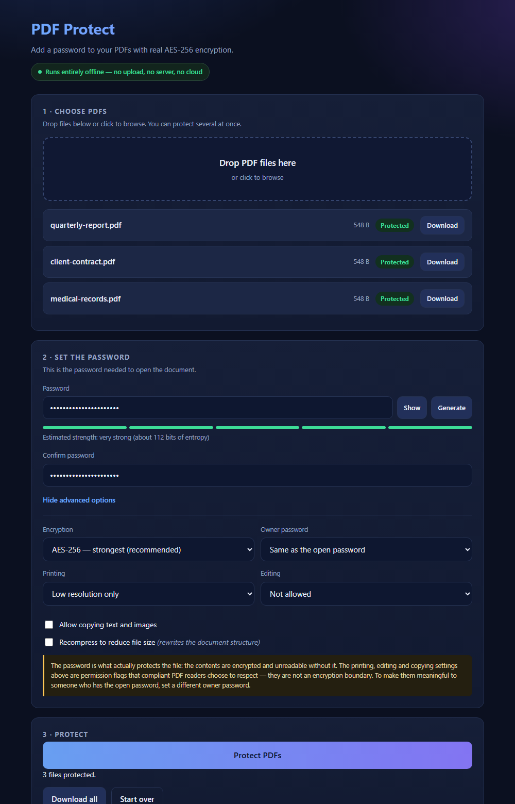

# PDF Protect — Password Protect a PDF Offline with AES-256 Encryption (No Upload)

[](LICENSE)
[-6ea8fe.svg)](#what-encryption-does-pdf-protect-use)
[](#how-is-the-no-upload-guarantee-actually-enforced)
[](#how-do-i-install-it)
[](#how-is-this-tested)
[](#how-does-it-work-under-the-hood)

**PDF Protect is a free, open-source tool that lets you password protect a PDF locally on your own computer, using real AES-256 encryption, without uploading the file anywhere.** It is a single HTML file you open in your browser. No installation, no signup, no server, no cloud, no internet connection required, no file size limit, and no watermark.

Most free "protect PDF online" tools — iLovePDF, Smallpdf, Sejda, and the PDF24 web version — upload your unprotected document to their servers before encrypting it. That is backwards: the confidential file travels off your device *before* it gets any protection. PDF Protect closes that gap by doing the encryption inside your browser tab.



---

## Table of contents

- [Quick start](#how-do-i-password-protect-a-pdf-without-uploading-it)
- [Features](#what-can-pdf-protect-do)
- [Comparison with iLovePDF, Smallpdf, Sejda and Adobe](#how-does-pdf-protect-compare-to-ilovepdf-smallpdf-and-adobe-acrobat)
- [Encryption details](#what-encryption-does-pdf-protect-use)
- [User password vs owner password](#what-is-the-difference-between-a-user-password-and-an-owner-password)
- [Privacy guarantee](#how-is-the-no-upload-guarantee-actually-enforced)
- [How it works](#how-does-it-work-under-the-hood)
- [Build from source](#how-do-i-build-it-from-source)
- [Testing](#how-is-this-tested)
- [Security notes](#security-notes-and-threat-model)
- [FAQ](#frequently-asked-questions)
- [Author](#author)

---

## How do I password protect a PDF without uploading it?

Download `pdf-protect.html`, open it in your browser, drag in your PDF, type a password, and click **Protect PDFs**. The encrypted file downloads immediately. The entire process happens on your device — no file or password is ever transmitted.

**Three steps:**

1. **Download the tool.** Grab [`pdf-protect.html`](pdf-protect.html) from this repository (1.9 MB, one file).
2. **Open it.** Double-click the file. It runs straight from `file://` in Chrome, Edge, Firefox, or any modern browser. You can disconnect from the internet first if you want to prove nothing is uploaded.
3. **Protect your PDF.** Drag one or more PDFs in, set a password, optionally adjust permissions, then click **Protect PDFs** and download the results.

That's it. There is nothing to install, no account to create, and no daily quota.

### How do I install it?

There is no installation. PDF Protect is a self-contained HTML document — jQuery, the qpdf encryption engine, and the WebAssembly binary are all embedded inside the single file. Save it anywhere, including a USB stick, and it will work on any machine with a browser, permanently and offline.

---

## What can PDF Protect do?

| Capability | Details |
| --- | --- |
| **AES-256 encryption** | PDF 2.0 security handler revision 6 (AESv3) — the strongest encryption the PDF specification defines |
| **AES-128 and RC4-128** | Optional legacy modes for older PDF viewers |
| **Open password** | Required to view the document; the contents are genuinely encrypted |
| **Separate owner password** | Optional distinct password that controls permissions |
| **Printing control** | Allow, restrict to low resolution, or block entirely |
| **Editing control** | Allow, or limit to comments, form filling, or page assembly only |
| **Copy protection** | Block extraction of text and images |
| **Batch processing** | Encrypt many PDFs in one run, with per-file status |
| **Already-encrypted input** | Detects protected PDFs, asks for the current password, and re-encrypts |
| **Password strength meter** | Entropy estimate with feedback |
| **Password generator** | Cryptographically secure, using `crypto.getRandomValues` with rejection sampling |
| **Unicode passwords** | Full UTF-8 support, including spaces and non-Latin scripts |
| **No limits** | No file size cap, no daily quota, no watermark, no signup, no ads |

---

## How does PDF Protect compare to iLovePDF, Smallpdf, and Adobe Acrobat?

PDF Protect encrypts on your device; the popular free web tools encrypt on their servers, which means your unprotected document is uploaded first. Adobe Acrobat Pro also encrypts locally but costs a subscription. PDF24's desktop app is local, while its web version uploads.

| | **PDF Protect** | iLovePDF / Smallpdf / Sejda | PDF24 (web) | PDF24 (desktop) | Adobe Acrobat Pro | LibreOffice |
| --- | --- | --- | --- | --- | --- | --- |
| Where encryption happens | Your browser | Their servers | Their servers | Your PC | Your PC | Your PC |
| Upload required | **No** | Yes | Yes | No | No | No |
| Works offline | **Yes** | No | No | Yes | Yes | Yes |
| Installation | **None** | None | None | Installer | Installer | Installer (~350 MB) |
| Cost | **Free** | Free tier + paid | Free | Free | Subscription | Free |
| Signup | **None** | Often | None | None | Account | None |
| Free-tier limits | **None** | Task and size caps | Ads | None | n/a | None |
| AES-256 | **Yes** | Varies | Yes | Yes | Yes | Yes |
| Batch encryption | **Yes** | Paid tiers | Yes | Yes | Yes | No |
| Open source | **Yes (MIT)** | No | No | No | No | Yes |
| Platform | **Any browser** | Any browser | Any browser | Windows | Win/macOS | Win/macOS/Linux |

The upload distinction matters more than it sounds. Server-based tools publish policies stating that files are deleted after roughly one to two hours, but a retention policy is a promise, not a technical guarantee you can verify. With client-side encryption there is nothing to promise — the file has nowhere to go.

---

## What encryption does PDF Protect use?

PDF Protect uses **256-bit AES in CBC mode with security handler revision 6 (AESv3)**, defined in PDF 2.0 / ISO 32000-2. This is the strongest encryption the PDF format supports. Every content stream and string in the document is encrypted, so the file is unreadable without the password.

The encryption is performed by [qpdf](https://github.com/qpdf/qpdf), the widely used open-source PDF library, compiled to WebAssembly. This matters: most JavaScript PDF libraries cannot do this properly. `pdf-lib`, the usual choice, dropped encryption support entirely, and many browser tools fall back to RC4, which is cryptographically broken.

### How do I know the output is really encrypted?

You can verify it independently. Running qpdf against a file produced by this tool reports:

```text
R = 6
stream encryption method: AESv3
string encryption method: AESv3
file encryption method: AESv3
```

`R = 6` is the AES-256 revision. During development, an encrypted sample was also handed to a completely separate PDF parser, which refused to open it with `No password given` — confirming the protection is real cryptography, not a flag that readers can ignore.

### Which encryption level should I choose?

Choose **AES-256**, the default. It is supported by every PDF reader released in roughly the last decade, including Adobe Acrobat, Preview on macOS, Chrome's built-in viewer, and mobile readers like PDF Expert.

| Mode | PDF version | Security | Use when |
| --- | --- | --- | --- |
| **AES-256 (R6)** | PDF 2.0 | Strong — recommended | Always, unless you have a specific reason not to |
| AES-128 | PDF 1.6 | Adequate | A very old viewer rejects AES-256 |
| RC4-128 | PDF 1.4 | **Broken** | Legacy systems only; avoid |

---

## What is the difference between a user password and an owner password?

The **user password** (also called the open password) is required to open the document and genuinely encrypts the contents. The **owner password** (or permissions password) does not restrict viewing — it only controls whether the printing, editing, and copying restrictions can be changed. Only the user password provides real security.

This distinction is the single most misunderstood part of PDF security, and it has a practical consequence in this tool:

- By default, PDF Protect sets the owner password to the same value as your open password. This is the simplest, least surprising behaviour.
- **If the two passwords are identical, anyone who can open the file can also lift the restrictions.** The permission settings are only meaningful against someone who has the open password if you set a *different* owner password under **Advanced options**.

### Do PDF permissions actually stop people printing or copying?

No, not reliably. Printing, editing, and copying flags are instructions that compliant PDF readers choose to honour. They are not an encryption boundary. Adobe Acrobat and most mainstream viewers respect them; plenty of other tools ignore them entirely.

Treat permissions as a clear statement of intent, not as enforcement. The open password is what actually protects the document. This is stated plainly inside the tool's interface too, rather than being buried in documentation.

---

## How is the "no upload" guarantee actually enforced?

PDF Protect ships a Content Security Policy of `default-src 'none'` with no network origin permitted. The browser itself blocks any attempt to contact a server, so the guarantee is enforced by the browser rather than merely claimed in a privacy policy.

The policy in the file reads:

```html
<meta http-equiv="Content-Security-Policy" content="
  default-src 'none';
  script-src 'unsafe-inline' 'wasm-unsafe-eval';
  style-src 'unsafe-inline';
  img-src data:;
  connect-src data: blob:;
  form-action 'none';
  base-uri 'none';">
```

No `http:` or `https:` origin appears anywhere. `data:` is how the WebAssembly binary is handed to the loader, and `blob:` is how the finished PDF is handed back to you as a download. Neither can reach the network.

### How can I verify that nothing is uploaded?

Three independent ways, in increasing order of rigour:

1. **Turn off your internet connection** and use the tool. It works normally. A server-based tool cannot do this.
2. **Open DevTools (F12) → Network tab**, then encrypt a file. You will see zero requests. Nothing is sent because there is nowhere to send it.
3. **Read the source.** `src/template.html` and `src/engine.js` are the complete, unminified application. There is no `fetch()` to any URL, no `XMLHttpRequest`, no analytics, no telemetry, and no third-party script tag.

---

## How does it work under the hood?

PDF Protect embeds qpdf compiled to WebAssembly inside a single HTML file. The PDF is read into browser memory, written into an in-memory virtual filesystem, encrypted by qpdf, and read back out as a downloadable blob. Nothing touches disk except the file you save.

```
Your PDF ──▶ FileReader ──▶ qpdf virtual FS ──▶ qpdf (WebAssembly)
                                                      │
                       encrypted bytes ◀──────────────┘
                              │
                              ▼
                     Blob ──▶ download
```

Two engineering details are worth calling out, because they are what make a single-file offline tool possible at all:

**The WebAssembly binary travels as a `data:` URL.** Browsers refuse to `fetch()` a sibling `.wasm` file from a page opened via `file://`, which is why nearly every WebAssembly tool requires a web server. Passing the 1.3 MB binary as a base64 `data:` URL through qpdf's `locateFile` hook sidesteps that restriction entirely, so the tool works by double-clicking.

**A fresh WebAssembly module instance is created per file.** Emscripten's exit bookkeeping and qpdf's `argv` handling are not designed for repeated `callMain()` calls on one module, so reusing an instance risks subtle state leakage between documents. This is verified by a test that confirms a password from a previous run cannot open a later file.

The stack is deliberately small: **jQuery 3.7.1** for the interface, **qpdf via WebAssembly** for encryption, and nothing else. No build step is required to use it, and no dependency is fetched at runtime.

---

## How do I build it from source?

The shipped `pdf-protect.html` is generated. Rebuild it after changing `src/template.html` or `src/engine.js`:

```powershell
powershell -ExecutionPolicy Bypass -File build.ps1
```

`build.ps1` inlines `vendor/jquery.min.js`, `vendor/qpdf.js`, `src/engine.js`, and a base64 copy of `vendor/qpdf.wasm` into the template, then verifies that no placeholder token survived substitution.

### Project structure

| Path | Purpose |
| --- | --- |
| `pdf-protect.html` | **The deliverable** — open this file |
| `src/template.html` | Interface markup, styles, and jQuery application code |
| `src/engine.js` | DOM-free wrapper around qpdf-wasm (argument building, encryption, password helpers) |
| `build.ps1` | Inlines every dependency into the single file |
| `run-tests.ps1` | Builds and runs both test suites |
| `docs/` | Screenshot used in this README |
| `vendor/` | jQuery 3.7.1 and the qpdf WebAssembly build |
| `tests/` | Test harnesses, browser driver, and sample PDF generator |

---

## How is this tested?

PDF Protect has **80 automated checks that run in headless Chrome**, split across two suites. Run them all with one command:

```powershell
powershell -ExecutionPolicy Bypass -File run-tests.ps1
```

**Engine suite (47 checks)** — qpdf argument construction, AES-256 round trips, rejection of wrong and missing passwords, AES-128 and RC4 modes, permission enforcement verified through `--show-encryption`, Unicode and awkward passwords, re-encrypting already-protected files, module isolation between runs, and the password generator and strength estimator.

**End-to-end suite (33 checks)** — drives the real built page: file selection, password validation and mismatch handling, the show/hide and generator controls, a full encryption run, inspection of the actual downloaded bytes, the already-encrypted and corrupt-input flows, and confirmation that zero Content Security Policy violations occur.

Both suites report results through `document.title`, which the runner reads over Chrome's DevTools HTTP endpoint — a small trick that avoids needing a WebSocket client just to read one string.

To export an encrypted file for inspection with outside tooling:

```powershell
powershell -ExecutionPolicy Bypass -File tests\export-encrypted.ps1
```

---

## Security notes and threat model

AES-256 PDF encryption is genuinely strong. **The weak link is almost always the password, not the cipher.** A 6-character dictionary word protected with AES-256 can be brute-forced; a 16-character random password cannot.

**What PDF Protect protects against:** anyone who obtains the encrypted file — an intercepted email, a lost USB stick, a misdirected attachment, a shared folder with the wrong permissions.

**What it cannot protect against:**

- **Weak passwords.** Encryption keys are derived from your password, so an attacker with the file can attempt an offline brute-force attack. Use 16 or more random characters, ideally from the built-in generator or a password manager.
- **Unprotected copies.** The original file still exists on your device. Delete it if it is sensitive.
- **Sending the password alongside the file.** Email the PDF, then share the password by SMS or phone. Sending both through the same channel defeats the encryption entirely.
- **Screenshots and re-printing.** Anyone who can legitimately open the document can photograph or re-scan it.
- **A forgotten password.** There is no recovery mechanism and no backdoor. An AES-256 PDF whose password is lost is permanently inaccessible. This is a property of correct encryption, not a defect.

---

## Frequently asked questions

### Is it really free?

Yes. PDF Protect is free and open source under the MIT license, with no paid tier, no daily quota, no watermark, no signup, and no advertising. You can use it commercially, modify it, and redistribute it.

### Can I password protect a PDF without Adobe Acrobat?

Yes. PDF Protect requires only a web browser and applies the same AES-256 encryption that Acrobat uses, at no cost. Adobe Acrobat Pro is a paid subscription; this is a single free HTML file with no installation.

### Is it safe to use online PDF password tools?

Only if the tool encrypts client-side. A server-based tool receives your unprotected document before it applies any protection, so the confidential file exists on someone else's infrastructure. PDF Protect never transmits the file or the password, which you can verify in your browser's Network tab.

### Can a password-protected PDF be cracked?

Not by breaking AES-256 itself — no practical attack against it exists. A PDF can be cracked by guessing the password, since encryption keys are derived from it and an attacker can attempt candidates offline. A long random password makes this computationally infeasible.

### How long should my PDF password be?

Use at least 16 random characters mixing upper case, lower case, digits, and symbols. The built-in generator produces a 20-character password using `crypto.getRandomValues`. Length matters far more than complexity rules; a long random passphrase from a password manager is ideal.

### Can I protect multiple PDFs at once?

Yes. Drop as many PDFs as you like into the tool and they are encrypted in one run with the same password and permission settings. Each file shows its own status, and any failure is reported per-file without aborting the rest of the batch.

### What if my PDF is already password protected?

PDF Protect detects it and asks for the file's current password, then re-encrypts the document with your new password in a single step. It cannot open a PDF whose password you do not know — that would defeat the purpose of encryption.

### Can I remove a password from a PDF with this tool?

Not currently. PDF Protect adds and changes passwords; it does not produce a decrypted copy. The underlying qpdf engine supports decryption, so this is a plausible future addition for files you can already open.

### Does it work on mobile?

The tool runs in mobile browsers, though the drag-and-drop interface is designed for desktop and large files are constrained by phone memory. PDFs encrypted with it open normally in all major mobile readers, including Adobe Acrobat, PDF Expert, and GoodReader, which prompt for the password.

### Does it work offline?

Yes, completely. Nothing is fetched at runtime — jQuery, the qpdf engine, and the WebAssembly binary are all embedded in the file. Disconnect from the internet, open the file, and it works exactly the same. That is the clearest demonstration that no upload occurs.

### Is there a file size limit?

No limit is imposed. The practical ceiling is your device's available memory, since the document is processed in browser memory. Encryption runs on the main thread, so a very large PDF may briefly freeze the tab while it is processed.

### Which browsers are supported?

Chrome and Edge are tested directly, opened from `file://`. Firefox, Safari, Opera, and Brave meet the requirements as well — WebAssembly, `crypto.getRandomValues`, and the FileReader API — all of which have been standard for years.

### Does the tool see or store my password?

No. The password is read from the input field into a JavaScript variable, passed to the WebAssembly encryption engine, and discarded when the tab closes. It is never written to disk, never stored in `localStorage`, and never transmitted, because the Content Security Policy prevents any network access at all.

---

## Contributing

Issues and pull requests are welcome. If you are changing behaviour, please run `run-tests.ps1` first and add a check covering your change — both test suites are fast and run entirely offline.

Useful additions people have asked about: password removal for files you can already open, a Web Worker so very large PDFs do not block the interface, and drag-and-drop reordering for batch runs.

---

## Author

**Roktim Saha** — self-taught developer and founder building web products, automation tools, AI systems, and open-source preservation utilities. Based in India.

- Website: [roktimsaha.com](https://roktimsaha.com)
- GitHub: [@hlotiim](https://github.com/hlotiim)
- X (Twitter): [@hlotiim](https://x.com/hlotiim)

### Other projects by Roktim Saha

| Project | What it does |
| --- | --- |
| [YouPreserver](https://github.com/hlotiim/YouPreserver) | Social media content preservation — backs up profiles, posts, media, and metadata with ZIP export workflows |
| [Bulk Images Downloader & Watermark Remover Suite](https://github.com/hlotiim/bulk-images-downloader-watermark-remover-replacer-suite) | Python batch image processing with scheduling, integrity checks, and checkpointing |
| [Instagram Highlight Downloader](https://github.com/hlotiim/instagram-profile-all-highlight-with-meta-data-downloader-as-a-zip) | Exports Instagram highlights with metadata as an organised ZIP archive |
| [Dynamic Placeholder Image Generator](https://github.com/hlotiim/Dynamic-Placeholder-Image-Generator) | PHP tool generating custom text images on the fly via URL parameters |
| [Dynamic Calculator Blog CMS](https://github.com/hlotiim/dynamic-calculator-blog-CMS) | PHP and MySQL CMS for building and managing calculator websites |

---

## License

Released under the [MIT License](LICENSE). Copyright © 2026 Roktim Saha.

## Credits

- [qpdf](https://github.com/qpdf/qpdf) by Jay Berkenbilt — the PDF engine doing the actual encryption
- [`@neslinesli93/qpdf-wasm`](https://www.npmjs.com/package/@neslinesli93/qpdf-wasm) — the WebAssembly build of qpdf
- [jQuery](https://jquery.com/) 3.7.1

---

<sub>PDF Protect is an offline PDF password protector for encrypting PDF files locally with AES-256. Related searches: password protect PDF free, add password to PDF without uploading, encrypt PDF offline, lock PDF with password, client-side PDF encryption, open-source PDF password tool, protect PDF without Adobe Acrobat.</sub>
